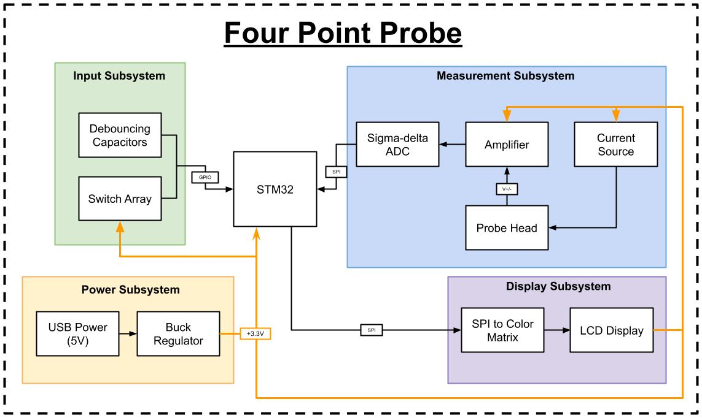

# Table of Contents

[Sep 16, 2024](#september-16,-2024)

[Sep 17, 2024](#september-17,-2024)

[Sep 24, 2024](#september-24,-2024)

# September 16, 2024

## Respository Setup

We setup the notebooks repository, will be adding updates and supporting documents as they come by in future meetings

## Proposal Preperation
Currently using Google Docs for the proposal for collaborative environment, may transition to LaTeX later TBD.

### Problem
Problem was inspired by ECE 444 Class: Theory and Fabrication of Integrated Circuits. Semiconductors are difficult to test and testing equipment is expensive because of that. We decided to tackle the four-point probe setup due to it being used in the lab and its lower complexity.

### Solution
We plan to design and create our own four-point probe capable of measuring the sheet resistance of wafers. We don't really have the capability to create probe-heads on our own, so we plan to order some. Four-point probes utilize a current-source and a voltage-measurement, the outer two probes supply current while the inner two probes measure the voltage. For user interface, we plan to use a keyboard and display. 

### Visual Aid
Key components will include the probe measurement setup, the analog to digital converter, the microcontroller for calculations, the display, and the keyboard. The probe measurements will interact with the ADC. The Microcontroller will interact with the ADC, Display, and Keyboard to manage proper I/O.

### High-Level Requirements
Discussion on High-level requirements. We are thinking that measurement precision is important, perhaps within ±50 mV. Wafers come in different sizes and shapes (?) so we would like to make sure that our system will work for a variety of different shapes, we think that 5 shapes is a good benchmark. Current four-point probes use a varying current source value for wafers, we are not sure why (will look into it? guess right now perhaps to slowly achieve an accruate value). We would like to use cost as a requirement, but will discuss with TA during meeting to make sure it's valid.

### Block Diagram
We have 3 subsystems within our design: Measurment, User Input, Display. Measurement subsystem will supply the current across the two outer probes and measure the voltage across the two inner probes. User Input is self explanatory, we will need to come up with a menu for interaction. Display is a bit ambiguous, but will likely include the various calculations used to determine what is being measured and the sheet resistance including the correction factor. 
Added a 4th subsystem, Power Supply subsystem as we will need to step down the 5V input to 3.3V (and potentially later 1.8V) for the other subsystems.

### Subsystem Overview
We transfered over the subsystem overview from our RPA, each subsystem has pretty simple interaction and requirements.

### Subsystem Requirements
TBD

### Tolerance Analysis
Some simulating software will be used to prove the feasability of the model. Point to discuss at TA meeting.

### Ethics & Safety
Unknown Ethical and Safety concerns currently. Don't put your finger by the sharp probes. Ensure calibration/accuracy before delivery to user? Point to discuss at TA meeting.

# September 17, 2024

## TA Meeting

### Logistics
Currently planning on keeping the same time slot each week, will input availability to the PACE document. Normal office hours will be available, orange boxes are dissapearing

### Block Diagram
Certain connections need more labels, will update and correct. Potentially add the 

### Ethics and Safety
Few ideas and examples provided, mainly the FA22 Team 1 Proprosal. 

### High Level Requirements
Update to full complete sentences. Add a few qualitative sentences about the features. Be modest at first as anything we put down are going to be required for the final design.

### Github/Notebook
Single notebook being updated by multiple users if fine, we need to upload the link to the PACE My Project tab.

### Tolerance
Add error rates. Potentially use the datasheets, and various calculations. SPICE can be used, but more than likely will be too complex and need input. 

### PCB Design Review
Keep posted, we should keep in mind to ensure preparation. Shipping will likely take a week, we should keep that in mind to potentially have multiple PCB versions with alterations in case delays occur.

### Resources
Team gets $150 through my.ECE. Eshop has free stuff. Meeting is timed or something to log hours.

# September 24, 2024

## TA Meeting

### Proposal Feedback
High-level requirements good enough. Block Diagram looks fine, not much to change. Subsystem Overview looks good. Subsystem requirement 2.3.1.2 need more detail, should add the range of voltage 
but its difficult as theres no paper/data for sweep length. Can add note that it's a work in progress, and that theres no paper and will be figured out at a later step. May change from requirement to overview because there is no exact guideline. 2.3.4.1 needs to include a tolerance range +- 0.1V +- 10mA. Tolerance Analysis should have formulas added to it, calculations will be good to include in the section. Can do power cause it doesn't matter rubric wise, can spin it to the other subsystems because the power supply ripple will affect other components. Overall, pretty good proposal. Proposal regrade is next Friday.

### Design Document
Next week Thursday. Don't overpromise uncertain deliverables. Must have high-level requirements included. 

### Design Review and PCB Review
In two weeks. Will have to sign up for time slot. 

### Microcontroller
1 MB should be plenty. C/C++ is the main language, but it may have Python support. They have a few free STMs here, but the better versions will have to be purchased. 

# October 01, 2024

## TA Meeting

### Design Document
Can utilize Proposal for certain sections. Switching away from STM for development kit access. Schematic should be used for Supporting Material. 

### Design Review/Peer Review
Pick a peer review timeslot, can ask question. Be somewhat formal for our clothing, but doesn't have to be super strict. 
Modularity is that there needs to be different subsystems. 
Detailed Design is going in depth into the subsystem, why does it work well, why is it needed, why is it good.
Scope is adequetly complex and potentially feasible. 
Each person must answer at least one question, but some people 
